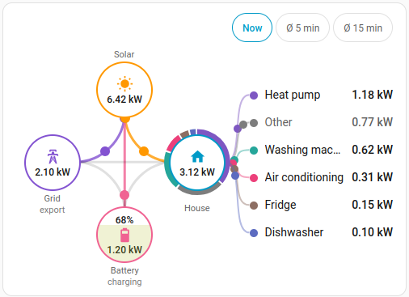
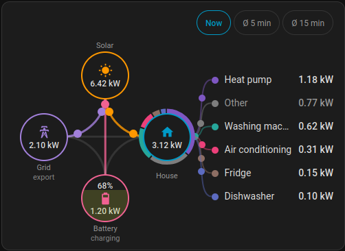

# EnerLens Card

Eine Energiefluss-Karte für Home Assistant. Das bekannte Kreuz aus PV, Netz,
Haus und Batterie — dazu eine Aufschlüsselung, woraus der Hauswert eigentlich
besteht.

*[English version of this page](README.md)*




> **Stand: veröffentlicht, vor 1.0.** Die Karte ist auf einer Anlage täglich im
> Einsatz und lässt sich über HACS als Custom Repository installieren. Die
> Konfiguration ist stabil; die Version bleibt unter 1.0, bis die Karte auf mehr
> als einer Anlage gelaufen ist.

## Was sie anders macht

**Verbraucher sind eine Aufschlüsselung, keine zusätzlichen Knoten.** Die Liste
neben dem Haus-Knoten und der Ring darum zeigen, woraus der Hauswert besteht.
Ein frei benennbarer Rest fasst zusammen, was nicht einzeln gemessen wird — auf
der Referenzanlage rund 45 % des Verbrauchs, was sichtbar besser aufgehoben ist
als versteckt.

**Drei Ansichtsmodi.** Ein Live-Leistungsdiagramm springt binnen Sekunden um
Kilowatt. Ein 5- oder 15-Minuten-Mittel beruhigt das Bild, ohne die Zahlen zu
verfälschen: Der aktive Modus ist immer benannt, und ein Klick öffnet weiterhin
den Dialog von Home Assistant mit der echten Historie.

**Die Liste sortiert sich und gleitet.** Zeilen ordnen sich im festen Takt nach
Leistung und gleiten auf ihre neue Position, statt zu springen. Die Werte
ändern sich sofort; nur die Reihenfolge wartet auf den Takt — eine springende
Zahl stört nicht, eine springende Zeile schon. Ein kleiner Filter-Knopf neben
den Ansichts-Chips zeigt alle Verbraucher unabhängig von ihrer Leistung — um den Verlauf
eines Geräts anzutippen, das gerade still geworden ist. Der Knopf bleibt wie die
gewählte Ansicht über einen Neuladen hinweg gesetzt.

**Messwerte werden nie stillschweigend verändert.** Sensoren aktualisieren
unterschiedlich schnell, deshalb kann die Summe der einzeln gemessenen
Verbraucher kurzzeitig über dem Hauswert liegen — auf der Referenzanlage in
etwa 1 % der Zeit, um bis zu 3 kW. Die Karte glättet das nicht weg: Der Rest
verschwindet einfach, und der Ring zeigt dann Anteile an der Verbrauchersumme.

## Installation

### HACS

1. HACS → ⋮ → *Benutzerdefinierte Repositories* → `https://github.com/wawersich/enerlens-card`
   hinzufügen, Typ *Dashboard*
2. Nach *EnerLens* suchen, installieren, Browser neu laden
3. HACS trägt die Ressource `/hacsfiles/enerlens-card/enerlens-card.js` selbst ein;
   erscheint die Karte nicht, unter *Einstellungen → Dashboards → Ressourcen* nachsehen

### Von Hand

1. `enerlens-card.js` aus dem letzten Release herunterladen
2. Nach `config/www/` kopieren
3. Unter *Einstellungen → Dashboards → Ressourcen* eintragen:
   `/local/enerlens-card.js` als *JavaScript-Modul*

## Konfiguration

Die Karte bringt einen GUI-Editor mit. Jede Entitätsform unten — eine Entität,
eine mit umgedrehtem Vorzeichen, zwei Entitäten oder eine abgeleitete Größe —
ist im Formular eine Auswahl; YAML braucht es also nie. Nur der Ladezustands-
Verlauf und die Verbraucherpalette bleiben dem YAML vorbehalten. Das YAML ist für
alle dokumentiert, die es vorziehen.

### Minimal

```yaml
type: custom:enerlens-card
entities:
  solar: sensor.pv_leistung
  grid: sensor.netz_leistung
  house: sensor.hausverbrauch
```

### Mit Batterie und Verbrauchern

```yaml
type: custom:enerlens-card
title: Energie
entities:
  solar: sensor.pv_leistung
  grid: sensor.netz_leistung
  house: sensor.hausverbrauch
  battery: sensor.batterie_leistung
  battery_soc: sensor.batterie_ladezustand
consumers:
  - entity: sensor.waermepumpe_leistung
    name: Wärmepumpe
  - entity: sensor.waschmaschine_leistung
  - entity: sensor.kuehlschrank_leistung
max_consumers: 5
```

### Vorzeichen

Die Karte folgt der Konvention von Home Assistant — derselben, die auch
`power-flow-card-plus` und das Energie-Dashboard verwenden:

| Größe | Positiv | Negativ |
|---|---|---|
| `grid` | Bezug aus dem Netz | Einspeisung |
| `battery` | Entladen | Laden |

Meldet dein Sensor es andersherum — viele Wechselrichter geben die Einspeisung
positiv aus — lässt sich das je Entität umkehren:

```yaml
entities:
  grid:
    entity: sensor.netz_leistung
    invert: true
```

Wer statt eines signierten Sensors getrennte Sensoren je Richtung hat, nennt
beide. Erwartet werden Werte ab null:

```yaml
entities:
  grid:
    import: sensor.netz_bezug
    export: sensor.netz_einspeisung
  battery:
    discharge: sensor.batterie_entladen
    charge: sensor.batterie_laden
```

**Eine Entität oder zwei?** Wenn deine Anlage beides hergibt — einen
vorzeichenbehafteten Sensor und ein Paar je Richtung — nimm den
vorzeichenbehafteten. Der Verlaufsdialog von Home Assistant zeigt immer nur eine
Entität, ein Paar verbirgt also die Hälfte: Tippst du bei 4 W Einspeisung auf den
Netz-Knoten, bekommst du die Einspeisekurve, in der das Netzladen von gestern
Abend überhaupt nicht vorkommt.

Gibt es keinen vorzeichenbehafteten Sensor, baut ein Helfer *Vorlage → Sensor*
einen (Einheit `W`, Geräteklasse `power`, Statusklasse `measurement`):

```jinja
{{ (states('sensor.netz_bezug')|float(0)
  - states('sensor.netz_einspeisung')|float(0))|round(0) }}
```

Gib ihm dieselbe Verfügbarkeitsregel wie dem abgeleiteten Haussensor weiter unten
— nicht verfügbar, sobald eine der Quellen es ist —, damit ein Aussetzer nicht als
Null in die Statistik wandert. Sein Wert wird dann aufgezeichnet, was für einen von
der Karte gerechneten Wert nie gilt: Verlauf, Langzeitstatistik, Automationen und
das Energie-Dashboard sehen ihn.

Geht beides nicht, ist die Zwei-Entitäten-Form in jeder angezeigten Zahl richtig;
nur die Historie bleibt geteilt.

### Fehlende Größen ableiten

`solar`, `grid`, `house` und `battery` bilden eine Gleichung:

```
solar + Bezug − Einspeisung + Entladen − Laden = house
```

Lässt man `house` weg, leitet die Karte es ab. Soll stattdessen eine der
anderen abgeleitet werden, wird sie ausdrücklich benannt:

```yaml
entities:
  solar: sensor.pv_leistung
  grid: sensor.netz_leistung
  house: sensor.hausverbrauch
  battery: derived        # kein Sensor für die Batterieleistung
```

Genau eine Größe darf abgeleitet werden — zwei Unbekannte lassen sich aus einer
Gleichung nicht bestimmen, und die Karte sagt das, statt zu raten. Abgeleitete
Knoten sind gekennzeichnet und nicht anklickbar, weil keine Entität dahinter
steht, deren Verlauf man zeigen könnte.

**Verlauf für den abgeleiteten Wert?** Ein abgeleiteter Knoten hat keine
Entität, also kann ein Tipp darauf keinen Verlauf öffnen. Wer den will, lässt
Home Assistant dieselbe Summe rechnen: Helfer *Template → Sensor* (Einheit `W`,
Geräteklasse `power`, Statusklasse `measurement`) mit

```jinja
{{ [0, states('sensor.pv_leistung')|float(0)
      - states('sensor.einspeisung')|float(0) + states('sensor.bezug')|float(0)
      + states('sensor.batterie_entladen')|float(0) - states('sensor.batterie_laden')|float(0)]|max|round(0) }}
```

und diesen Sensor als `house` eintragen. Es ist die Formel der Karte, nur wird
sie jetzt aufgezeichnet — Verlauf, Statistik und Automationen bekommen sie mit.

**Zur Genauigkeit:** Den Hauswert abzuleiten ist bequem, aber nur so gut wie
seine Eingangswerte. Auf der Referenzanlage lag er, aus 60-Sekunden-Sensoren
für Netz und Batterie abgeleitet, bei Lastwechseln bis zu 8,7 kW daneben,
während ein gemessener 5-Sekunden-Sensor binnen 4 Sekunden folgte. Wer einen
schnellen Haussensor hat, sollte ihn nehmen.

Die Ausnahme ist ein Haussensor, der nicht die ganze PV sieht. Ein
Hybrid-Wechselrichter berechnet „Haus" aus seinen eigenen Strings, dem Netz und
der Batterie; ein Mikro-Wechselrichter, der hinter dem Zähler einspeist,
erscheint darin als *weniger Hauslast*, nicht als Erzeugung. Enthält `solar`
solche Quellen und stammt `house` vom Wechselrichter, ist das Haus um genau
diesen Betrag zu klein — dann besser ableiten.

### Netzausfall (optional)

Manche Anlagen melden, ob überhaupt Netz anliegt — ein Wechselrichter, der
Inselbetrieb kann, meist schon. Dann kann die Karte das auch sagen, statt 0 W
anzuzeigen, was genauso aussieht wie eine ruhige Minute ohne Fluss:

```yaml
entities:
  grid_status:
    entity: sensor.netzstatus
    outage: [not_detected]
    ok: [ok]
```

`outage` ist Pflicht, und daran wird nichts geraten: Jede Integration benennt
ihre Zustände anders, ein aus einer Anlage übernommener Standard wäre öfter
falsch als richtig. Eine bloße Entitäts-ID ohne Zustandsnamen wird ignoriert,
mit einem Hinweis in der Konsole. `ok` darf fehlen, wenn die Entität ihre
eigenen `options` veröffentlicht — Aufzählungssensoren und `input_select` tun
das —, denn dann gilt alles aus `options` außer den Ausfall-Zuständen als
„Netz liegt an".

Trage die **Rohwerte** ein, nicht das, was Home Assistant anzeigt: Ein
Aufzählungssensor zeigt einen übersetzten Namen, aus „Nicht erkannt" auf dem
Schirm wird also `not_detected` darunter. Groß-/Kleinschreibung und Leerzeichen
sind egal, eine Übersetzung nicht — deshalb bietet der Editor die Werte der
Entität zur Auswahl an.

Während des Ausfalls trägt der Netz-Knoten ein rotes X über dem Symbol und
zeigt *kein Netz* statt einer Zahl, über dem Kreuz erscheint ein roter Streifen.
Ein Tipp auf den Knoten öffnet die Status-Entität, denn sie beantwortet die
Frage „seit wann".

**Alles andere hält den letzten Zustand.** `unavailable`, `unknown` und jeder
nicht aufgeführte Zustand lassen den Ausfall so, wie er war. Das ist Absicht:
Ein Ausfall nimmt die Verbindung häufig mit, und eine Integration kann ihren
letzten bekannten Wert noch Minuten lang weiterliefern, bevor sie aufgibt. Wer
Schweigen als „Netz ist zurück" liest, verliert den Ausfall genau dann, wenn er
echt ist.

Beim Laden fragt die Karte den Recorder nach dem letzten echten Zustand der
vergangenen zehn Tage, damit eine während des Ausfalls geöffnete Seite mit dem
Ausfall beginnt. Findet sie nichts, behauptet sie nichts und zeichnet das Netz
wie gewohnt.

Ohne `grid_status` gibt es all das nicht — keinen Streifen, kein X, keine
zusätzliche Abfrage.

### Alle Optionen

| Option | Standard | Bedeutung |
|---|---|---|
| `title` | — | Überschrift der Karte |
| `entities.solar` | Pflicht | PV-Leistung, W oder kW |
| `entities.grid` | Pflicht | Netzleistung, signiert |
| `entities.house` | abgeleitet | Hausverbrauch |
| `entities.battery` | — | Batterieleistung, signiert |
| `entities.battery_soc` | — | Ladezustand in % |
| `entities.grid_status` | — | `{entity, outage, ok}` — siehe *Netzausfall* |
| `consumers` | — | Liste aus `{entity, name, color, icon, min_w}` |
| `min_consumer_w` | `10` | Verbraucher darunter zählen zum Rest; ein eigenes `min_w` am Verbraucher hat Vorrang |
| `max_consumers` | alle | Nur die stärksten werden gelistet |
| `update_interval_s` | `5` | Wie oft die Liste neu sortiert |
| `power.unit` | `kW` | `kW` oder `W`; Watt immer als ganze Zahl |
| `power.decimals` | `2` | Nachkommastellen bei kW: 1, 2 oder 3 |
| `list.enabled` | an mit Verbrauchern | Liste anzeigen |
| `list.rest_label` | lokalisiert | Bezeichnung des Rests |
| `list.title` | — | Überschrift über der Liste |
| `ring.enabled` | an mit Verbrauchern | Ring anzeigen |
| `view.default_mode` | `current` | `current`, `avg_short` oder `avg_long` |
| `view.avg_short_minutes` | `5` | Kurzes Mittelungsfenster |
| `view.avg_long_minutes` | `15` | Langes Mittelungsfenster |
| `view.show_selector` | `true` | Umschalter anzeigen |
| `view.remember` | `true` | Ansicht und Filter-Knopf je Browser merken |
| `flow.inactive_lines` | `show` | `show`, `dim` oder `hide` |
| `flow.animation` | `auto` | `auto`, `on` oder `off` |
| `flow.min_w` | `10` | Darunter bewegt sich nichts; Netz und Batterie zeigen kein Zustandswort |
| `flow.peak_w` | `6000` | Ein Regler für die Bewegung: Leistung, bei der die Punkte ihr Maximum erreichen; die drei Schwellen darunter sind standardmäßig 1/12, 1/3 und 1/1 davon |
| `flow.slow_below_w` | `500` | Bis hier ein langsamer Punkt |
| `flow.full_speed_w` | = `more_dots_above_w` | Ab hier hat der einzelne Punkt sein Höchsttempo; getrennt von `more_dots_above_w` setzen, um Tempo und Anzahl zu entkoppeln |
| `flow.more_dots_above_w` | `2000` | Ab hier kommen Punkte hinzu |
| `flow.max_dots_at_w` | `6000` | Wo die Punktzahl ihr Maximum erreicht |
| `flow.max_dots` | `5` | Obergrenze für Punkte |
| `flow.slow_s` | `5` | Sekunden pro Durchlauf an der unteren Schwelle |
| `flow.fast_s` | `1.8` | Sekunden pro Durchlauf an der oberen Schwelle |
| `colors.*` | HA-Energiefarben | Jeder CSS-Wert, auch `var(--…)` |
| `colors.soc_stops` | rot → gelb → grün | Verlauf für den Ladezustand |
| `colors.consumer_palette` | 10 Farben | Reihum für Verbraucher ohne eigene Farbe |
| `icons.*` | mdi-Standard | Icon je Knoten |

`flow.animation: auto` folgt der Einstellung „Bewegung reduzieren" des Geräts —
die steht im Betriebssystem, nicht in Home Assistant.

### Farben

Die Standardwerte kommen aus den Energie-Theme-Variablen von Home Assistant,
sodass die Karte ohne Konfiguration zum Energie-Dashboard passt. Wer stattdessen
nach gut und schlecht färben will:

```yaml
colors:
  grid_export: "#43a047"        # Einspeisen ist gut
  grid_import: "#e53935"        # Beziehen nicht
  battery_charge: "#43a047"
  battery_discharge: "#e53935"
```

## Sprachen

Die Karte richtet sich nach der Sprache des angemeldeten Home-Assistant-Nutzers
(*Profil → Sprache*). Es gibt keine eigene Spracheinstellung auf der Karte —
das hieße, dieselbe Wahl zweimal zu pflegen.

| | |
|---|---|
| Unterstützt | Englisch, Deutsch |
| Ausgewählt über | `hass.language`, Rückfall auf Englisch |
| Nicht übersetzt | Alles Selbstgeschriebene — Titel, Verbrauchernamen, `rest_label` |

Eine Sprache hinzuzufügen erfordert keinen Code: `src/translations/en.json`
kopieren, die Werte übersetzen, die Schlüssel behalten und als `<code>.json`
ablegen. Ein Test prüft, dass jede Übersetzungsdatei genau dieselben Schlüssel
trägt wie die englische — ein fehlender Eintrag lässt also den Build scheitern,
statt in irgendeinem Dashboard als roher Schlüssel aufzutauchen.

## Umstieg von power-flow-card-plus

- Die Vorzeichen sind identisch — vorhandene Sensoren sollten unverändert
  funktionieren.
- Aus den einzelnen Verbrauchern wird die `consumers`-Liste, und sie sind eine
  *Aufschlüsselung* des Hauswerts statt zusätzlicher Knoten. Der Rest zeigt,
  was übrig bleibt.
- `watt_threshold` gibt es nicht; stattdessen `min_consumer_w` für die Liste
  und `flow.min_w` für die Animation. Die beiden sind bewusst getrennt.

## Entwicklung

```bash
./scripts/setup.sh     # Abhängigkeiten installieren
npm run check          # Typen, Lint, Tests, Build
npm run build          # Einzeldatei-Bundle in dist/
./scripts/deploy.sh    # bauen und in ein lokales Home Assistant kopieren
```

`deploy.sh` baut mit `CARD_SUFFIX=-dev`; die lokale Karte meldet sich dann als
`<enerlens-card-dev>` an, mit eigenem Editor und eigener Lovelace-Ressource. So
lassen sich ein Entwicklungsstand und eine über HACS installierte Karte im
selben Browser betreiben — ohne die Umbenennung gewinnt die zuerst geladene
Datei den Elementnamen und bespielt alle Dashboards. Unter dem offiziellen Namen
ausliefern: `CARD_SUFFIX= ./scripts/deploy.sh`.

In [`docs/`](docs/) liegen die Entwurfsentscheidungen (`docs/decisions/`), der
Animations-Spike, der zur Web Animations API geführt hat, die Testumgebung mit
ihren Abspielskripten und die Screenshots.

Die Anwenderdokumentation — diese Seite und [`README.md`](README.md) — wird
zweisprachig gepflegt.

## Lizenz

MIT
